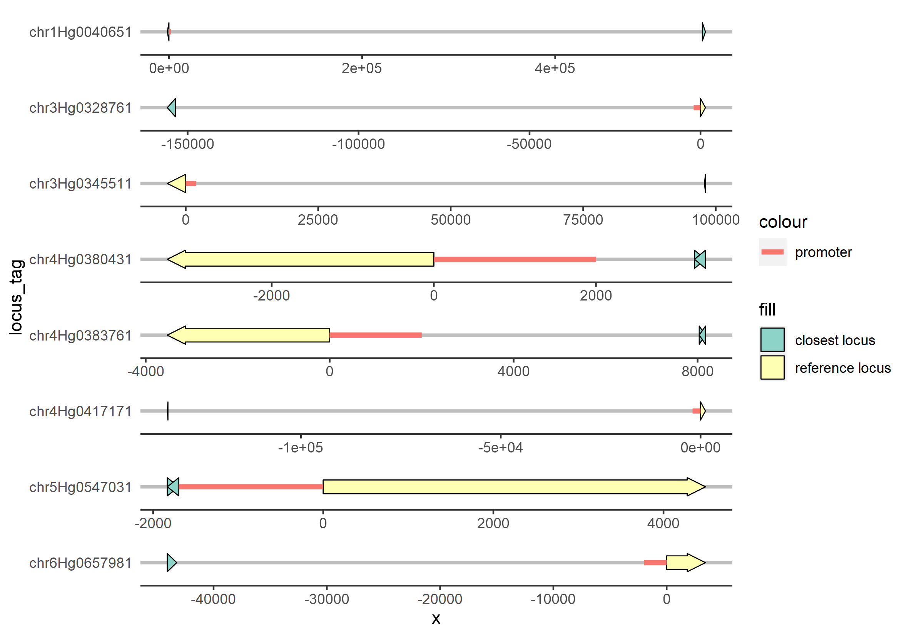

<!-- README.md is generated from README.Rmd. Please edit that file -->

# CSCpromoters

<!-- badges: start -->
<!-- badges: end -->

## About

The goal of CSCpromoters is to extract the sequences of promoter regions
from the genome fasta files.

## Description

`CSCpromoters` allows users to extract the sequences of promoter regions
from the genome fasta files. `CSCpromoters` can calculate the length of
promoters based on the distance to the closest upstream gene.
`CSCpromoters` also provides the option for users to enter the
user-defined minimum and maximum promoter length.

## Installation

You can install the development version of `CSCpromoters` from
[GitHub](https://github.com/) with:

``` r
# install.packages("devtools")
devtools::install_github("thiagomaf/CSCpromoters")

# These commands will not work while the repositories are private.
# There are work-around, we can talk about it later.
```

Alternatively, you can download this git repository and install it
locally. To do that, download the content of this repository by clicking
the big green `Code` button (on the top right) and then click
`Download ZIP`. Download it to a local folder.

- [CSCpromoters](https://github.com/thiagomaf/CSCpromoters)

After that, run the following code line:

``` r
devtools::install_local("PATH/CSCpromoters-main.zip")
```

## Usage Example

This is a basic example which shows you how to solve a common problem:

### SETUP

#### Load libraries

``` r
library(magrittr)
library(ggplot2)
library(gggenes)
library(CSCpromoters)
```

#### Define constants

``` r
# MIN-YAO, set eval=TRUE and comment the next block to run on your computer

gff_folder <- paste0(
  "./genome_barley_GP/" # user defined path
)

fasta_list <- (function(
    .chr_list = c(
      "chr1H", "chr2H", "chr3H", "chr4H", "chr5H", "chr6H", "chr7H", "chrUn"
    ),
    .folder   = "./genome_barley_GP/" # user defined path
) {
  .folder %>% 
    paste0(paste0("Hordeum_vulgare.refseq[", .chr_list, "].fasta")) %>% 
    magrittr::set_names(.chr_list)
})()
```

### LOAD DATA

#### H. vulgare cv. Golden Promise TxDB from GFF file

``` r
txdb <- paste0(
  gff_folder,
  "Horvul_GP_v1r1_Apollo_30_06_20_named_product_GO.gff3"
) %>%
  make_txdb(
    .data_source = "Hv - Golden Promise",
    .organism    = "Hordeum vulgare"
  )
```

    ## Import genomic features from the file as a GRanges object ... OK
    ## Prepare the 'metadata' data frame ... OK
    ## Make the TxDb object ... OK

``` r
# For some reason this cannot be properly loaded from an .RData or .rda file,
# must be run on every new R session
```

#### H. vulgare cv. Golden Promise annotations

``` r
annotations <- txdb %>%
  get_txdb_annotation()
```

### GET PROMOTERS

#### Wrap-up function

``` r
annotations %>%
  # Wrap-up function
  get_promoters(
    .txdb       = txdb,
    .FASTA_list = fasta_list,
    .keep       = c( # user defined gene list
      "chr6Hg0657981",
      "chr1Hg0040651",
      "chr3Hg0328761",
      "chr4Hg0417171",
      "chr3Hg0345511",
      "chr4Hg0383761",
      "chr5Hg0547031",
      "chr4Hg0380431",
      "chr4Hg0421931",
      "chr7Hg0679581"
    )
  )
```

    ## DNAStringSet object of length 8:
    ##     width seq                                               names               
    ## [1]  2000 GTAACAATAGTAACAAGGTGCAC...CCAGCCGTACAGACGATATTTCA chr1Hg0040651
    ## [2]  2000 AACTAATCTGTGGTTGGATGACT...ATTGTTCCGGCACGGGGCTGGGG chr3Hg0328761
    ## [3]  2000 ACATAGAAAGTATGCACATGACA...CCTCCCTCCCTCCCTCCCCCCAA chr3Hg0345511
    ## [4]  2000 TGCATTTGACACATCAGATTTGG...ATGGCGCGGCTACGTCTGCTACG chr4Hg0380431
    ## [5]  2000 TTTAATGCAATGTATGAATATGA...AAGACTGCATAAAGTTTGGATCA chr4Hg0383761
    ## [6]  2000 GAGAGCCTTTGGTCAGCAAAGAT...GCTCTCGATCGCATGGAAGAAAA chr4Hg0417171
    ## [7]  1698 GACATATATGTGTCTCATAATGA...TACCCGCGCTACTATTACAGGAA chr5Hg0547031
    ## [8]  2000 GACGGACGGATGGATCATGGATG...TGTGAGCCTGAGATGCAGGGGAA chr6Hg0657981

#### Explicit pipeline

``` r
promoter_sizes <- annotations %>%
  # Choose which loci to use
  filter_locus(
    .keep = c(
      "chr6Hg0657981",
      "chr1Hg0040651",
      "chr3Hg0328761",
      "chr4Hg0417171",
      "chr3Hg0345511",
      "chr4Hg0383761",
      "chr5Hg0547031",
      "chr4Hg0380431",
      "chr4Hg0421931",
      "chr7Hg0679581"
    )
  ) %>% 
  # Calculate distances to closest upstream locus
  get_promoter_distances() %>%
  # Trim found upstream distances and define promoter lengths
  set_promoter_sizes(.min_size = 100, .max_size = 2000)

# Get promoter sequences
my_promoters <- promoter_sizes %>% 
  get_promoter_sequences(.txdb = txdb, .FASTA_list = fasta_list)
```

# PLOT

``` r
promoter_sizes %>
  plot_promoter_maps(annotations)
```



# EXPORT SEQUENCES

``` r
my_promoters %>%
  write_fasta("data/promoters_Min-Yao.fasta")
```

## Dependencies

### Libraries

- Biostrings
- data.table
- dplyr
- GenomicFeatures
- progress
- magrittr
- multidplyr
- Rsamtools
- stringr
- tidyr
- plyr

### Files

- `[gff_folder]`/Annotation_Golden_Promise_v1r1_Apollo_300620_mRNA.fasta
- `[gff_folder]`/Horvul_GP_v1r1_Apollo_30_06_20_named_product_GO.gff3
- `[fasta_list]`/Hordeum_vulgare.refseq\[chr1H\].fasta
- `[fasta_list]`/Hordeum_vulgare.refseq\[chr2H\].fasta
- `[fasta_list]`/Hordeum_vulgare.refseq\[chr3H\].fasta
- `[fasta_list]`/Hordeum_vulgare.refseq\[chr4H\].fasta
- `[fasta_list]`/Hordeum_vulgare.refseq\[chr5H\].fasta
- `[fasta_list]`/Hordeum_vulgare.refseq\[chr6H\].fasta
- `[fasta_list]`/Hordeum_vulgare.refseq\[chr7H\].fasta
- `[fasta_list]`/Hordeum_vulgare.refseq\[chrUn\].fasta
