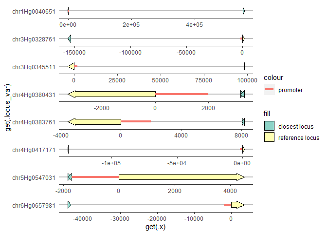

CSCpromoters - ggplot/gggenes
================

# SETUP

## Load libraries

``` r
library(magrittr)
library(CSCpromoters)
library(ggplot2)
```

    ## Warning: package 'ggplot2' was built under R version 4.2.2

``` r
library(gggenes)
```

    ## Warning: package 'gggenes' was built under R version 4.2.2

# LOAD DATA

``` r
promoter_sizes
```

    ## # A tibble: 11 × 5
    ##    locus_tag     chr   closest_locus   dist promoter_size
    ##    <chr>         <fct> <chr>          <dbl>         <dbl>
    ##  1 chr1Hg0040651 chr1H chr1Hg0040661 552456          2000
    ##  2 chr3Hg0328761 chr3H chr3Hg0328751 153586          2000
    ##  3 chr3Hg0345511 chr3H chr3Hg0345531  97877          2000
    ##  4 chr4Hg0380431 chr4H chr4Hg0380441   3216          2000
    ##  5 chr4Hg0380431 chr4H chr4Hg0380451   3216          2000
    ##  6 chr4Hg0383761 chr4H chr4Hg0383771   8036          2000
    ##  7 chr4Hg0383761 chr4H chr4Hg0383781   8036          2000
    ##  8 chr4Hg0417171 chr4H chr4Hg0417161 133279          2000
    ##  9 chr5Hg0547031 chr5H chr5Hg0547011   1698          1698
    ## 10 chr5Hg0547031 chr5H chr5Hg0547021   1698          1698
    ## 11 chr6Hg0657981 chr6H chr6Hg0657971  43253          2000

``` r
annotations
```

    ##            locus_tag   chr strand     begin       end
    ##     1: chr1Hg0000001 chr1H      1     89740     90864
    ##     2: chr1Hg0000021 chr1H      1     93362     94320
    ##     3: chr1Hg0000031 chr1H      1    110000    110416
    ##     4: chr1Hg0000041 chr1H      1    112001    112685
    ##     5: chr1Hg0000051 chr1H      1    114434    114966
    ##    ---                                               
    ## 87537: chrUng0875421 chrUn     -1 268583989 268584107
    ## 87538: chrUng0875491 chrUn     -1 268926847 268926965
    ## 87539: chrUng0875501 chrUn     -1 268938021 268938515
    ## 87540: chrUng0875511 chrUn     -1 268965722 268965840
    ## 87541: chrUng0875521 chrUn     -1 268966056 268966123

# PLOT

``` r
promoter_sizes %>%
  get_plotdata_locus(annotations)
```

    ## # A tibble: 11 × 11
    ##    chr   locus_tag   close…¹   dist promo…² strand  begin    end close…³ close…⁴
    ##    <fct> <chr>       <chr>    <dbl>   <dbl>  <dbl>  <int>  <int>   <dbl>   <int>
    ##  1 chr1H chr1Hg0040… chr1Hg… 552456    2000     -1 2.56e8 2.56e8       1  2.56e8
    ##  2 chr3H chr3Hg0328… chr3Hg… 153586    2000      1 5.22e8 5.22e8      -1  5.22e8
    ##  3 chr3H chr3Hg0345… chr3Hg…  97877    2000     -1 5.56e8 5.56e8      -1  5.56e8
    ##  4 chr4H chr4Hg0380… chr4Hg…   3216    2000     -1 1.15e8 1.15e8       1  1.15e8
    ##  5 chr4H chr4Hg0380… chr4Hg…   3216    2000     -1 1.15e8 1.15e8      -1  1.15e8
    ##  6 chr4H chr4Hg0383… chr4Hg…   8036    2000     -1 1.39e8 1.39e8       1  1.39e8
    ##  7 chr4H chr4Hg0383… chr4Hg…   8036    2000     -1 1.39e8 1.39e8      -1  1.39e8
    ##  8 chr4H chr4Hg0417… chr4Hg… 133279    2000      1 4.34e8 4.34e8      -1  4.34e8
    ##  9 chr5H chr5Hg0547… chr5Hg…   1698    1698      1 4.84e8 4.84e8       1  4.84e8
    ## 10 chr5H chr5Hg0547… chr5Hg…   1698    1698      1 4.84e8 4.84e8      -1  4.84e8
    ## 11 chr6H chr6Hg0657… chr6Hg…  43253    2000      1 4.69e8 4.69e8       1  4.69e8
    ## # … with 1 more variable: closest_end <int>, and abbreviated variable names
    ## #   ¹​closest_locus, ²​promoter_size, ³​closest_strand, ⁴​closest_begin

``` r
promoter_sizes %>%
  get_plotdata_locus(annotations) %>%
  get_plotdata_promoter()
```

    ## # A tibble: 11 × 8
    ##    chr   locus_tag     strand     begin       end promoter_size         x   xend
    ##    <fct> <chr>          <dbl>     <int>     <int>         <dbl>     <int>  <dbl>
    ##  1 chr1H chr1Hg0040651     -1 255751754 255753467          2000 255753467 2.56e8
    ##  2 chr3H chr3Hg0328761      1 521825685 521827137          2000 521825685 5.22e8
    ##  3 chr3H chr3Hg0345511     -1 556199897 556203370          2000 556203370 5.56e8
    ##  4 chr4H chr4Hg0380431     -1 115103303 115106591          2000 115106591 1.15e8
    ##  5 chr4H chr4Hg0380431     -1 115103303 115106591          2000 115106591 1.15e8
    ##  6 chr4H chr4Hg0383761     -1 139297778 139301308          2000 139301308 1.39e8
    ##  7 chr4H chr4Hg0383761     -1 139297778 139301308          2000 139301308 1.39e8
    ##  8 chr4H chr4Hg0417171      1 434340785 434342013          2000 434340785 4.34e8
    ##  9 chr5H chr5Hg0547031      1 483519485 483523978          1698 483519485 4.84e8
    ## 10 chr5H chr5Hg0547031      1 483519485 483523978          1698 483519485 4.84e8
    ## 11 chr6H chr6Hg0657981      1 469059276 469062703          2000 469059276 4.69e8

``` r
promoter_sizes %>%
  plot_promoter_maps(annotations)
```

<!-- -->
